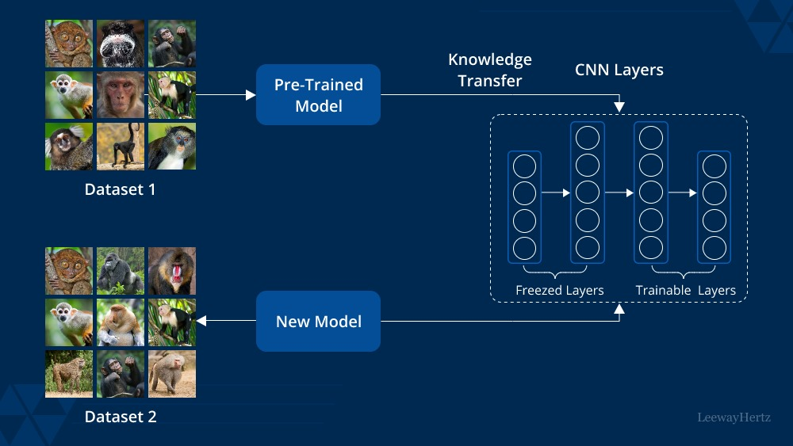
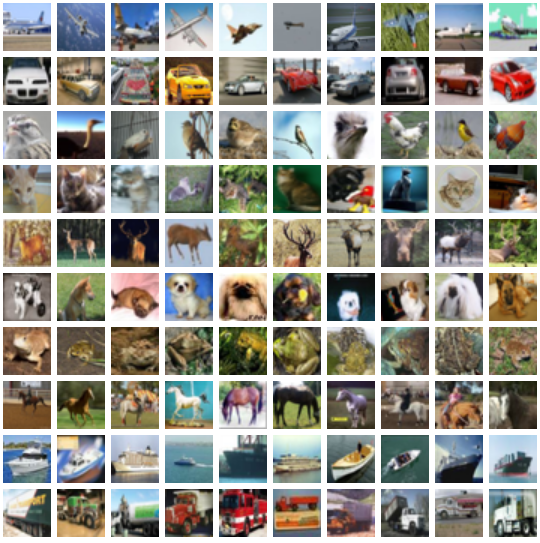

<h1 align="center">Exploring Layer-Wise Fine-Tuning of a Pretrained ResNet-50 on CIFAR-100: Impact Analysis and Performance Evaluation</h1>
  <div align="center">
  
  </div>

  <p align="center">
  <a href="https://github.com/supernuper" target="_blank">Nofar Ben Porat</a>
  <br>
  <a href="https://github.com/hananbenshitrit" target="_blank">Hanan Ben Shitrit</a>
</p>

## Background
In this project, the goal is to explore the impact of unfreezing different numbers of layers in a ResNet50 model when training on the CIFAR-100 dataset.
The approach involves six distinct steps, where progressively more layers of ResNet50 are unfrozen during training. 
Initially, only one layer is unfrozen, allowing the rest of the network to remain fixed (Also known as feature extraction). In subsequent steps,three, six, twelve, fifteen, and finally, twenty-five layers are unfrozen. This strategy enables a gradual adaptation of the network to the CIFAR-100 dataset, starting from a heavily pre-trained using only feature extraction on the model and moving towards a more fine-tuned version.


## Prerequisites
|Library         | Version |
|----------------------|----|
|`Python`|  `3.10.12`|
|`torch`|  `2.3.1+cu121`|
|`gdown`|  `4.7.3`|
|`torchvision`|  `0.18.1+cu121`|
|`Pillow`|  `9.4.0`|
|`matplotlib`|  `3.7.1`|
|`numpy`|  `1.26.4`|

## Files in the repository

|File name         | Purpose |
|----------------------|------|
|`code_files/Imports.ipynb`| Necessary Imports for the Project|
|`code_files/Dataset.ipynb`| Loading the CIFAR100 dataset and providing an example of the images| 
|`code_files/Split.ipynb`| Splitting the dataset to train-valid-test| 
|`code_files/HFuncs_HParam_DataLoaders.ipynb`| Helper functions for defining the layers parameters to learn, training and evaluating. Hyperparameters definition. Creating dataloaders| 
|`code_files/Model_Train_Eval.ipynb`| Training and evaluating the model on our data using all of the above|

## Pretrained model - ResNet-50
ResNet-50 is a deep convolutional neural network with 50 layers, known for its use of residual connections (skip connections) that help mitigate the vanishing gradient problem, making it easier to train. It’s part of the ResNet family, introduced in 2015, and is widely used for image classification and other computer vision tasks. The model is available pretrained on ImageNet via `torchvision`, making it ideal for transfer learning.

Key Features:
- 50 Layers: Deep architecture with multiple convolutional and fully connected layers.
- Residual Connections: Skip connections that allow the network to learn residuals, improving training stability and performance.
- Pretrained Weights: Available with pretrained weights on ImageNet, enabling quick transfer learning for new tasks.
- Versatile: Commonly used in image classification, object detection, and feature extraction tasks.

```python
import torch
from torchvision.models import resnet50, ResNet50_Weights
model = resnet50(weights=ResNet50_Weights.DEFAULT)
```
## The dataset - CIFAR100
<div align="center">
  
</div>

CIFAR-100 is a popular image classification dataset that is widely used in the field of computer vision and deep learning. It consists of 100 different classes of images, with each class containing 600 images. The images are small, with a resolution of 32x32 pixels, and are in RGB format (three color channels: red, green, and blue).
The dataset is divided into 50,000 training images and 10,000 test images.

## Results 
### Feature Extraction 
```python
Epoch: 1 | Loss: 10.2540 | Training accuracy: 5.788% Epoch Time: 53.68 secs
Epoch: 2 | Loss: 4.7189 | Training accuracy: 28.540% Epoch Time: 52.66 secs
Epoch: 3 | Loss: 3.0201 | Training accuracy: 40.282% Epoch Time: 51.98 secs
Epoch: 4 | Loss: 2.3396 | Training accuracy: 48.862% Epoch Time: 53.43 secs
Epoch: 5 | Loss: 1.9607 | Training accuracy: 55.608% Epoch Time: 53.00 secs
Epoch: 6 | Loss: 1.7356 | Training accuracy: 59.345% Epoch Time: 52.83 secs
Epoch: 7 | Loss: 1.5622 | Training accuracy: 62.713% Epoch Time: 53.44 secs
Epoch: 8 | Loss: 1.4533 | Training accuracy: 64.778% Epoch Time: 52.94 secs
Epoch: 9 | Loss: 1.3689 | Training accuracy: 66.438% Epoch Time: 52.85 secs
Epoch: 10 | Loss: 1.3041 | Training accuracy: 67.675% Epoch Time: 53.35 secs
Epoch: 11 | Loss: 1.2572 | Training accuracy: 68.510% Epoch Time: 52.82 secs
Epoch: 12 | Loss: 1.2248 | Training accuracy: 68.947% Epoch Time: 54.41 secs
Epoch: 13 | Loss: 1.2130 | Training accuracy: 69.260% Epoch Time: 52.87 secs
Epoch: 14 | Loss: 1.1969 | Training accuracy: 69.582% Epoch Time: 53.17 secs
Epoch: 15 | Loss: 1.2051 | Training accuracy: 67.890% Epoch Time: 52.33 secs

Accuracy: 50.150%
```
### Fine-tuning the last 3 Layers
```python
Epoch: 1 | Loss: 7.6341 | Training accuracy: 23.985% Epoch Time: 55.46 secs
Epoch: 2 | Loss: 2.6999 | Training accuracy: 49.343% Epoch Time: 55.63 secs
Epoch: 3 | Loss: 1.8451 | Training accuracy: 60.398% Epoch Time: 55.30 secs
Epoch: 4 | Loss: 1.4721 | Training accuracy: 68.140% Epoch Time: 56.25 secs
Epoch: 5 | Loss: 1.2301 | Training accuracy: 73.123% Epoch Time: 57.19 secs
Epoch: 6 | Loss: 1.0435 | Training accuracy: 78.990% Epoch Time: 55.92 secs
Epoch: 7 | Loss: 0.9027 | Training accuracy: 82.483% Epoch Time: 55.49 secs
Epoch: 8 | Loss: 0.7776 | Training accuracy: 85.938% Epoch Time: 55.99 secs
Epoch: 9 | Loss: 0.7082 | Training accuracy: 88.070% Epoch Time: 55.11 secs
Epoch: 10 | Loss: 0.6358 | Training accuracy: 89.560% Epoch Time: 55.93 secs
Epoch: 11 | Loss: 0.5869 | Training accuracy: 90.535% Epoch Time: 55.10 secs
Epoch: 12 | Loss: 0.5546 | Training accuracy: 91.258% Epoch Time: 55.64 secs
Epoch: 13 | Loss: 0.5369 | Training accuracy: 91.465% Epoch Time: 55.11 secs
Epoch: 14 | Loss: 0.5210 | Training accuracy: 91.760% Epoch Time: 55.44 secs
Epoch: 15 | Loss: 0.5190 | Training accuracy: 91.748% Epoch Time: 54.90 secs

Accuracy: 55.300%
```
### Fine-tuning the last 6 Layers
```python
Epoch: 1 | Loss: 5.9412 | Training accuracy: 22.975% Epoch Time: 54.01 secs
Epoch: 2 | Loss: 2.3124 | Training accuracy: 57.840% Epoch Time: 54.93 secs
Epoch: 3 | Loss: 1.4450 | Training accuracy: 71.847% Epoch Time: 53.67 secs
Epoch: 4 | Loss: 1.0532 | Training accuracy: 82.242% Epoch Time: 53.76 secs
Epoch: 5 | Loss: 0.7577 | Training accuracy: 87.640% Epoch Time: 54.10 secs
Epoch: 6 | Loss: 0.5133 | Training accuracy: 94.855% Epoch Time: 53.59 secs
Epoch: 7 | Loss: 0.3475 | Training accuracy: 97.715% Epoch Time: 54.69 secs
Epoch: 8 | Loss: 0.2370 | Training accuracy: 98.915% Epoch Time: 53.77 secs
Epoch: 9 | Loss: 0.1673 | Training accuracy: 99.515% Epoch Time: 54.27 secs
Epoch: 10 | Loss: 0.1257 | Training accuracy: 99.765% Epoch Time: 53.82 secs
Epoch: 11 | Loss: 0.1074 | Training accuracy: 99.862% Epoch Time: 53.80 secs
Epoch: 12 | Loss: 0.1000 | Training accuracy: 99.835% Epoch Time: 54.47 secs
Epoch: 13 | Loss: 0.0882 | Training accuracy: 99.918% Epoch Time: 54.40 secs
Epoch: 14 | Loss: 0.0759 | Training accuracy: 99.915% Epoch Time: 54.51 secs
Epoch: 15 | Loss: 0.0738 | Training accuracy: 99.925% Epoch Time: 53.50 secs

Accuracy: 53.400%
```
### Fine-tuning the last 12 Layers
```python
Epoch: 1 | Loss: 5.0775 | Training accuracy: 40.832% Epoch Time: 57.40 secs
Epoch: 2 | Loss: 1.6795 | Training accuracy: 71.380% Epoch Time: 56.76 secs
Epoch: 3 | Loss: 0.9643 | Training accuracy: 86.877% Epoch Time: 56.25 secs
Epoch: 4 | Loss: 0.5120 | Training accuracy: 95.845% Epoch Time: 56.64 secs
Epoch: 5 | Loss: 0.2495 | Training accuracy: 98.825% Epoch Time: 56.49 secs
Epoch: 6 | Loss: 0.1293 | Training accuracy: 99.662% Epoch Time: 56.92 secs
Epoch: 7 | Loss: 0.0675 | Training accuracy: 99.845% Epoch Time: 56.85 secs
Epoch: 8 | Loss: 0.0525 | Training accuracy: 99.572% Epoch Time: 56.85 secs
Epoch: 9 | Loss: 0.0528 | Training accuracy: 99.948% Epoch Time: 57.17 secs
Epoch: 10 | Loss: 0.0385 | Training accuracy: 99.975% Epoch Time: 57.02 secs
Epoch: 11 | Loss: 0.0257 | Training accuracy: 99.977% Epoch Time: 56.93 secs
Epoch: 12 | Loss: 0.0189 | Training accuracy: 99.980% Epoch Time: 56.23 secs
Epoch: 13 | Loss: 0.0130 | Training accuracy: 99.983% Epoch Time: 56.99 secs
Epoch: 14 | Loss: 0.0098 | Training accuracy: 99.983% Epoch Time: 58.12 secs
Epoch: 15 | Loss: 0.0142 | Training accuracy: 99.972% Epoch Time: 56.49 secs

Accuracy: 60.420%
```
### Fine-tuning the last 15 Layers
```python
Epoch: 1 | Loss: 4.6894 | Training accuracy: 53.417% Epoch Time: 56.68 secs
Epoch: 2 | Loss: 1.3141 | Training accuracy: 81.958% Epoch Time: 58.81 secs
Epoch: 3 | Loss: 0.6258 | Training accuracy: 94.950% Epoch Time: 60.63 secs
Epoch: 4 | Loss: 0.2482 | Training accuracy: 99.305% Epoch Time: 61.21 secs
Epoch: 5 | Loss: 0.0931 | Training accuracy: 99.892% Epoch Time: 61.04 secs
Epoch: 6 | Loss: 0.0497 | Training accuracy: 99.953% Epoch Time: 55.52 secs
Epoch: 7 | Loss: 0.0167 | Training accuracy: 99.977% Epoch Time: 55.45 secs
Epoch: 8 | Loss: 0.0217 | Training accuracy: 99.975% Epoch Time: 55.13 secs
Epoch: 9 | Loss: 0.0182 | Training accuracy: 99.975% Epoch Time: 55.84 secs
Epoch: 10 | Loss: 0.0177 | Training accuracy: 99.975% Epoch Time: 55.38 secs
Epoch: 11 | Loss: 0.0134 | Training accuracy: 99.980% Epoch Time: 55.73 secs
Epoch: 12 | Loss: 0.0092 | Training accuracy: 99.983% Epoch Time: 55.52 secs
Epoch: 13 | Loss: 0.0091 | Training accuracy: 99.983% Epoch Time: 56.24 secs
Epoch: 14 | Loss: 0.0055 | Training accuracy: 99.983% Epoch Time: 56.20 secs
Epoch: 15 | Loss: 0.0056 | Training accuracy: 99.983% Epoch Time: 55.34 secs

Accuracy: 66.100%
```
### Fine-tuning the last 25 Layers
```python
Epoch: 1 | Loss: 4.2789 | Training accuracy: 60.365% Epoch Time: 62.52 secs
Epoch: 2 | Loss: 1.0720 | Training accuracy: 87.495% Epoch Time: 62.23 secs
Epoch: 3 | Loss: 0.4431 | Training accuracy: 97.385% Epoch Time: 62.81 secs
Epoch: 4 | Loss: 0.1406 | Training accuracy: 99.690% Epoch Time: 62.90 secs
Epoch: 5 | Loss: 0.0451 | Training accuracy: 99.680% Epoch Time: 62.11 secs
Epoch: 6 | Loss: 0.0330 | Training accuracy: 99.970% Epoch Time: 62.14 secs
Epoch: 7 | Loss: 0.0151 | Training accuracy: 99.980% Epoch Time: 62.03 secs
Epoch: 8 | Loss: 0.0070 | Training accuracy: 99.972% Epoch Time: 62.02 secs
Epoch: 9 | Loss: 0.0058 | Training accuracy: 99.983% Epoch Time: 61.30 secs
Epoch: 10 | Loss: 0.0080 | Training accuracy: 99.983% Epoch Time: 62.73 secs
Epoch: 11 | Loss: 0.0037 | Training accuracy: 99.983% Epoch Time: 62.25 secs
Epoch: 12 | Loss: 0.0025 | Training accuracy: 99.983% Epoch Time: 62.08 secs
Epoch: 13 | Loss: 0.0027 | Training accuracy: 99.983% Epoch Time: 61.55 secs
Epoch: 14 | Loss: 0.0024 | Training accuracy: 99.980% Epoch Time: 61.44 secs
Epoch: 15 | Loss: 0.0022 | Training accuracy: 99.983% Epoch Time: 61.41 secs

Accuracy: 69.990%
```
### Evaluation on the test set (using the 25 layers setup since it got best performance on validation)
```python
Epoch: 1 | Loss: 3.7327 | Training accuracy: 69.178% Epoch Time: 79.12 secs
Epoch: 2 | Loss: 0.8810 | Training accuracy: 90.884% Epoch Time: 79.13 secs
Epoch: 3 | Loss: 0.3078 | Training accuracy: 98.490% Epoch Time: 78.20 secs
Epoch: 4 | Loss: 0.0692 | Training accuracy: 99.814% Epoch Time: 79.00 secs
Epoch: 5 | Loss: 0.0167 | Training accuracy: 99.936% Epoch Time: 79.33 secs
Epoch: 6 | Loss: 0.0055 | Training accuracy: 99.978% Epoch Time: 78.98 secs
Epoch: 7 | Loss: 0.0031 | Training accuracy: 99.976% Epoch Time: 78.99 secs
Epoch: 8 | Loss: 0.0024 | Training accuracy: 99.974% Epoch Time: 79.93 secs
Epoch: 9 | Loss: 0.0019 | Training accuracy: 99.978% Epoch Time: 78.59 secs
Epoch: 10 | Loss: 0.0014 | Training accuracy: 99.982% Epoch Time: 78.68 secs
Epoch: 11 | Loss: 0.0011 | Training accuracy: 99.982% Epoch Time: 79.09 secs
Epoch: 12 | Loss: 0.0010 | Training accuracy: 99.982% Epoch Time: 78.85 secs
Epoch: 13 | Loss: 0.0009 | Training accuracy: 99.982% Epoch Time: 78.82 secs
Epoch: 14 | Loss: 0.0008 | Training accuracy: 99.982% Epoch Time: 78.91 secs
Epoch: 15 | Loss: 0.0008 | Training accuracy: 99.982% Epoch Time: 78.77 secs

Accuracy: 72.180%
```

## How To Run
To run the project, you can download all the notebooks under the folder `code_files`, combine them, and execute them by their order:
`Imports.ipynb` -> `Dataset.ipynb` -> `Split.ipynb` -> `HFuncs_HParam_DataLoaders.ipynb` -> `Model_Train_Eval.ipynb`

A more efficient method (if you don't mind just viewing the outputs of the notebooks) is as follows - first, clone the repository:
```python
!git clone https://github.com/supernuper/DL_project.git
```
Then, start running the files by their order:
`Imports.ipynb` -> `Dataset.ipynb` -> `Split.ipynb` -> `HFuncs_HParam_DataLoaders.ipynb` -> `Model_Train_Eval.ipynb`
Using the following commands:
```python
%run /content/DL_project/code_files/Imports.ipynb
%run /content/DL_project/code_files/Dataset.ipynb
%run /content/DL_project/code_files/Split.ipynb
%run /content/DL_project/code_files/HFuncs_HParam_DataLoaders.ipynb
%run /content/DL_project/code_files/Model_Train_Eval.ipynb
```
(The path `/content/` assumes you're running the project in Google Colab. You can also change it to `./` or to any directory where you cloned the repository)

Notes: 
- We recommend running one line at a time to view proper execution and output.
- The command `%run` is a `magic command` and is specific to IPython environments, such as Jupyter Notebooks and Google Colab.
- About the runtime: The final file, `Model_Train_Eval.ipynb`, executes code that trains and evaluates the model 7 times - 6 times with different fine-tuning setups and once more for the final test evaluation. This process will take some time (approximately 65 seconds per epoch, totaling around 6825 seconds or 113.75 minutes). This estimate is based on running with a Google Colab T4 GPU.
- The output for the final file will include 6 evaluations: feature extraction, fine-tuning of 3, 6, 12, 15, and 25 layers, and finally the evaluation on the test set, in that order.

## Sources
* CIFAR-100: https://www.cs.toronto.edu/~kriz/cifar.html
* Resnet50: https://pytorch.org/vision/main/models/generated/torchvision.models.resnet50.html
* images/TransferLearning.jpg: https://www.leewayhertz.com/transfer-learning/
