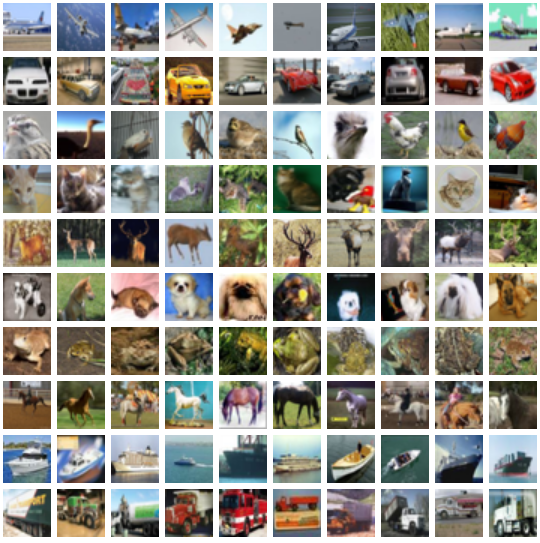

# <p align="center">Exploring Layer-Wise Fine-Tuning of a Pretrained ResNet-50 on CIFAR-100: Impact Analysis and Performance Evaluation</p>
 


  <p align="center">
   Nofar Ben Porat</a>
  <br>
    Hanan Ben shitrit
  </p>
  
## Background
In this project, the goal is to explore the impact of unfreezing different numbers of layers in a ResNet50 model when training on the CIFAR-100 dataset.
The approach involves six distinct steps, where progressively more layers of ResNet50 are unfrozen during training. 
Initially, only one layer is unfrozen, allowing the rest of the network to remain fixed. In subsequent steps,three, six, twelve, fifteen, and finally, twenty-five layers are unfrozen. This strategy enables a gradual adaptation of the network to the CIFAR-100 dataset, starting from a heavily pre-trained using only feature extraction on the model and moving towards a more fine-tuned version.


## Prerequisites
|Library         | Version |
|----------------------|----|
|`Python`|  `3.10.12`|
|`torch`|  `2.3.1+cu121`|
|`gdown`|  `4.7.3`|
|`torchvision`|  `0.18.1+cu121`|
|`Pillow`|  `9.4.0`|
|`matplotlib`|  `3.7.1`|
|`numpy`|  `1.26.4`|

## Files in the repository

|File name         | Purpsoe |
|----------------------|------|
|``| images from the dataset|
|`split.py`| the Train/Val/Test split we used|
|`Data.py`| loading the data from MeGlass and splitting it accourding to the tags| 
|`train.py`| code for training the model| 
|`output`| the output of the train| 
|`Project_report.pdf`| project report of our network|

## Pretrained model - ResNet-50
ResNet-50 is a deep convolutional neural network with 50 layers, known for its use of residual connections (skip connections) that help mitigate the vanishing gradient problem, making it easier to train. It’s part of the ResNet family, introduced in 2015, and is widely used for image classification and other computer vision tasks. The model is available pretrained on ImageNet via `torchvision`, making it ideal for transfer learning.

Key Features:
- 50 Layers: Deep architecture with multiple convolutional and fully connected layers.
- Residual Connections: Skip connections that allow the network to learn residuals, improving training stability and performance.
- Pretrained Weights: Available with pretrained weights on ImageNet, enabling quick transfer learning for new tasks.
- Versatile: Commonly used in image classification, object detection, and feature extraction tasks.

```python
import torch
from torchvision.models import resnet50, ResNet50_Weights
model = resnet50(weights=ResNet50_Weights.DEFAULT)
```
## The dataset - CIFAR100
<div align="center">
  
</div>

CIFAR-100 is a popular image classification dataset that is widely used in the field of computer vision and deep learning. It consists of 100 different classes of images, with each class containing 600 images. The images are small, with a resolution of 32x32 pixels, and are in RGB format (three color channels: red, green, and blue).
The dataset is divided into 50,000 training images and 10,000 test images.

## Results 

### results after unfreezing the last layer   

### results after unfreezing the last ?? layers 

### results with and without data augmentation

## How To Run
?????????????????????????


## Sources
* CIFAR-100: https://www.cs.toronto.edu/~kriz/cifar.html
* Resnet50: https://pytorch.org/vision/main/models/generated/torchvision.models.resnet50.html
